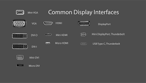

# The-Difference-Between-Displays
By Wyatt Wirt

This Tutorial with help with understanding the difference between types of Past, Present, and the Future of Displays. The tutorial will give the user a history of each portion of Displays histories and information to identify each. The user will read through the text, be give clues throughout, and then attempt to decide which kind of display is being described.

The target audience for this tutorial is beginning IT students or even those just deciding to get into IT to better understand the differences between these types of displays. Especially with the younger generation becoming more involved in computers, gaming, etc knowing the differences is important.

## Past Displays

Cathode ray tube  
Flip-flap/disc display  
Monochrome plasma display  

In the beginning there was light.. being emmited by a Cathode Ray Tube display for the first computers. A CRT display was revolutionary at the time as it let you transform dots of light into specific images and display those pictures or even videos. They work by modulating, accelerating, and reflecting electron beams onto the screen in order to create its image.

https://en.wikipedia.org/wiki/Cathode-ray_tube

## Modern Displays

Full-color plasma display  
Organic light-emitting diode  
LED display  

The modern and most common displays are LED, these use individual Light Emitting Diodes to create images. Each one of these diodes is called a pixel and combine all together to make an image, the more pixels the higher the resolution. The higher the resoluation the more clear the image will look and easier it is to see.

## Future Displays

Micro LED  
QD-LED  

For this portion we will focus specifically on QD-LED or Quantum Dot LED. This is the beginning of nano technology, Samsung is currently one of the leading manufacturers and devlopers of modern displays and have been working hard to produce the next generation of displays. They currently share much of what we currently have with standard LED displays with a few exceptions. To begin the nanoparticles are actually layered inside both flat and curved displays to sandwich the display with nanoparticles. What this does is add to the amount of individual particles in the screen increasing resolution and adding to color vibrancy.

https://insights.samsung.com/2020/01/09/what-is-quantum-dot-technology/

## Connection Types

Component:  Audio and Video, with a maximum refresh rate of 60HZ, and a resolution of 720p.  
VGA:  Video Only, with a maximum refresh rate of 60HZ, and a resolution of 720p.  
DVI:  Video Only, with a maximum refresh rate of 144 HZ, and resolution of 1080p.  
DisplayPort:  Video Only, with a maximum refresh rate of 144 HZ+,and resolution of 3840 x 2160 pixels.  
HDMI:  Audio and video signal has a maximum refresh rate of 144 HZ+, and resolution of 3820 x 2160 pixels.  

# Now that we know about these forms of Displays, Let's put that knowledge to use!

For the next part of this Tutorial we are going to look at a few different examples of displays and match them to there correct type.

EX: A display that is deep and in the shape of a box, while having a very projected feel would be a Cathode Ray Tube Display.

First Part:

Casey has a flat display that stands thin and on a nice base. He hooks it up to his computer using display port.

What kind of display is represented here?

Second Part:

John has a thick and squared monitor that he has connected to his desktop with component.

What kind of display is represented here?

Third Part:
Nick has a thin display hung on his wall that has a very vibrant image. It is connected via HDMI

What kind of display is represented here?

## How did you do on these questions?

Displays is a very difficult and confusing concept when you first look at it. (Pun Intended) I hope that you enjoyed your time in my Tutorial and learned a little something along the way! Once again Thank you and have a wonderful day!

Answers:

| Question        | Answer      
| ------------- |:-------------:| 
| Question 1     | Modern | 
| Question 2    | Past      | 
| Question 3 | Future      |

